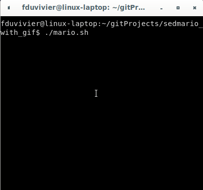

# sedmario
NES Super Mario Bros level 1 written in pure sed!

# How to run

Clone the repo and run the shell script wrapper:
```
$ ./mario.sh
```

Use left and right arrows to move, up arrow or space to jump.

# Preview Gif

